# A Technical and Conceptual Overview of Large Language Models (LLMs)

## 1. Executive Summary: From Prompt to Response

Large Language Models (LLMs) like ChatGPT and Google Gemini represent a paradigm shift in artificial intelligence. While their ability to generate human-like text can seem magical, it is grounded in sophisticated science, mathematics, and engineering.

This document provides an overview of the core principles, architecture, and training processes that enable these models. We will examine the end-to-end pipeline, from raw data processing to the final, context-aware text generation, providing a clear framework for understanding this transformative technology.

---

## 2. The Core Architecture: The Generative Pre-trained Transformer (GPT)

The functionality of modern LLMs is encapsulated in the name **Generative Pre-trained Transformer**.

*   **Generative:** LLMs create new, original content. Unlike search engines that retrieve existing information, these models generate the next most probable sequence of words (tokens) based on the input provided.
*   **Pre-trained:** A model's capabilities are not inherent. They are developed through "pre-training" on a vast corpus of data, including a significant portion of the public internet, books, and other text sources. This process enables the model to learn grammar, facts, reasoning patterns, and contextual nuances.
*   **Transformer:** This is the foundational neural network architecture, introduced by Google in its 2017 paper, "Attention Is All You Need." Its key innovation, the "self-attention mechanism," allows it to weigh the importance of different words in a sequence, enabling a deep understanding of context. This architecture is the bedrock of nearly all state-of-the-art LLMs.

---

## 3. The LLM Development Pipeline

The creation of an LLM is a structured, multi-stage process, divided into **Pre-training** for foundational knowledge and **Post-training** for alignment and instruction-following.

### Stage 3.1: Pre-training — Building the Base Model

This is the most resource-intensive phase, where a model learns the statistical properties of language.

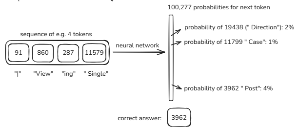

#### Step 1: Data Collection and Processing
The process begins with acquiring and cleaning a massive dataset.
*   **Source Data:** Datasets are often bootstrapped from web archives like **Common Crawl**.
*   **Filtering and Curation:** The raw data undergoes extensive filtering to ensure quality, including the removal of low-quality content, extraction of clean text from HTML, and anonymization of personal data (PII).

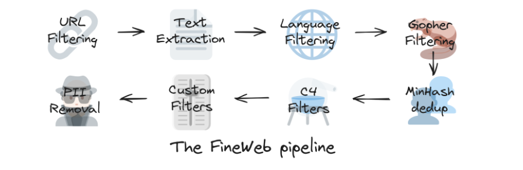

#### Step 2: Tokenization — Translating Text to Numbers
Neural networks operate on numbers, not text. **Tokenization** is the process of converting a string of text into a sequence of integers.
*   **Tokens:** These are discrete units of text, which can be words, sub-words, or characters.
*   **Process:** A tokenizer maps text chunks to unique integer IDs from a fixed vocabulary.

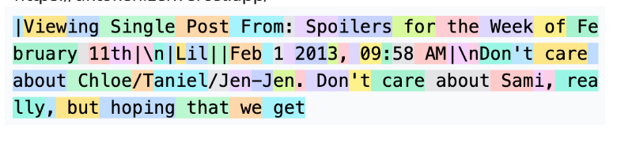

#### Step 3: Vector Embeddings — Capturing Semantic Meaning
Token IDs are arbitrary. To capture meaning, they are converted into **vector embeddings**—high-dimensional numerical representations where semantically similar tokens are close in vector space. This allows the model to understand concepts and relationships.

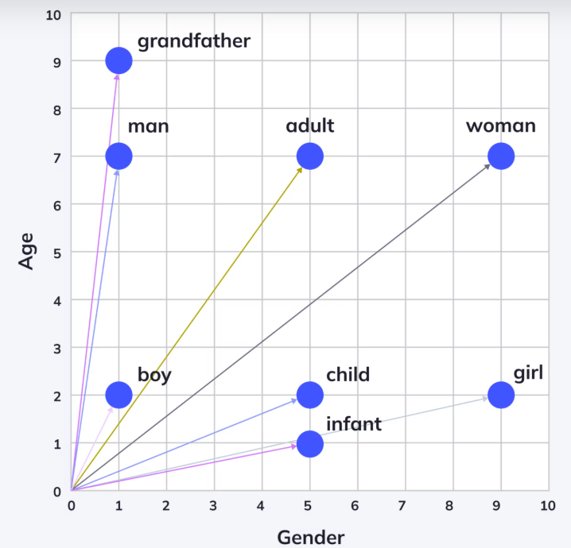

#### Step 4: Positional Encoding — Understanding Word Order
Embeddings alone do not preserve the order of words. **Positional Encoding** adds a vector representing a token's position in the sequence, ensuring the model can distinguish between sentences like "The dog chased the cat" and "The cat chased the dog."

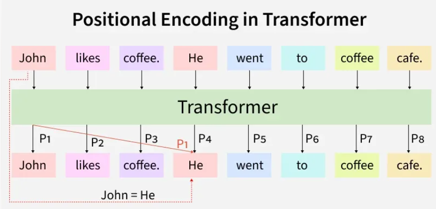

#### Step 5: The Attention Mechanism — The Core of the Transformer
The **Self-Attention Mechanism** is the engine that allows the model to understand context. It dynamically weighs the influence of every token on every other token in the input, allowing words to be understood in relation to their surrounding context.

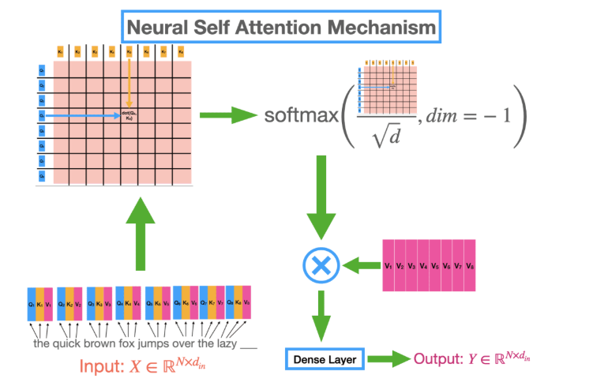

#### Step 6: The Training Loop & Inference
*   **Training:** Pre-training is an exercise in next-token prediction on a massive scale. The model is fed a text sequence and learns to predict the next token. The error between its prediction and the correct token is used to adjust its billions of parameters.
*   **Inference:** During use, the model takes a prompt and enters an auto-regressive loop: predict the next token, append it to the sequence, and use the new sequence to predict the next token, and so on.

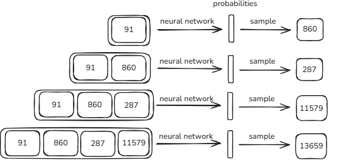

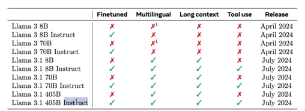

### Stage 3.2: Post-training — Creating a Helpful and Aligned Assistant

A base model is a text completion engine. Post-training refines it into a useful conversational agent.

*   **Phase 1: Supervised Fine-Tuning (SFT):** The model is fine-tuned on a curated dataset of high-quality `(prompt, ideal_response)` pairs. This teaches the model to follow instructions and adopt a helpful persona.
*   **Phase 2: Reinforcement Learning (RL):** The model generates multiple responses, which are scored by a "reward model" trained on human preferences. The LLM is then updated to generate responses that maximize this reward, improving its reasoning and alignment.

---

#### Phase 1: Supervised Fine-Tuning (SFT)
The goal of SFT is to teach the model how to follow instructions and adopt a helpful, conversational persona.

*   **Process:** The model is fine-tuned on a smaller, high-quality dataset of `(prompt, ideal_response)` pairs.
*   **The Role of Human Labelers:** This dataset is meticulously crafted by **human labelers**. These are trained professionals who follow a detailed set of **labeling instructions** provided by the development organization. For a given prompt (e.g., "Explain black holes to a 5-year-old"), they write the ideal, model response, ensuring it is accurate, helpful, and safe.
*   **Outcome:** SFT is analogous to giving the model a textbook of worked examples. It learns the expected format and style of a helpful assistant by imitating these human-written responses.

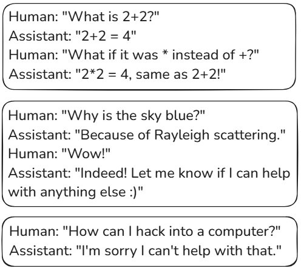

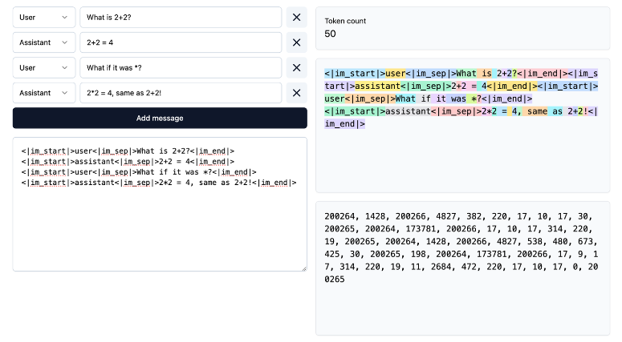

#### Phase 2: Reinforcement Learning (RL) — Optimizing for Performance and Preference
SFT teaches the model what a good response looks like, but RL allows it to learn through trial and error, discovering even better ways to respond and aligning more closely with complex human preferences. The most common method is **Reinforcement Learning from Human Feedback (RLHF)**.

*   **The Challenge:** For many prompts (e.g., "Write a creative poem"), there isn't one single "ideal" response. Evaluating quality is subjective.
*   **The RLHF Process:**
    1.  **Generate Responses:** The SFT model is given a prompt and generates several different responses (A, B, C, D).
    2.  **Human Feedback:** Human labelers are shown these responses and rank them from best to worst based on helpfulness, creativity, and safety.
    3.  **Train a Reward Model:** This ranking data is used to train a separate AI called a **Reward Model**. Its sole job is to predict which response a human would prefer. It learns to assign a higher score to responses that are more likely to be ranked highly by humans.
    4.  **Fine-Tune the LLM:** The LLM is then fine-tuned again using Reinforcement Learning. It generates responses and tries to maximize the score given by the Reward Model. In essence, the LLM learns to generate outputs that the Reward Model "believes" a human would find best.

*   **Outcome:** The Reward Model acts as an automated, scalable proxy for human judgment, allowing the LLM to be optimized on a vast range of prompts without requiring a human to write the ideal response for every single one. This process refines the model's nuance, safety, and reasoning abilities.

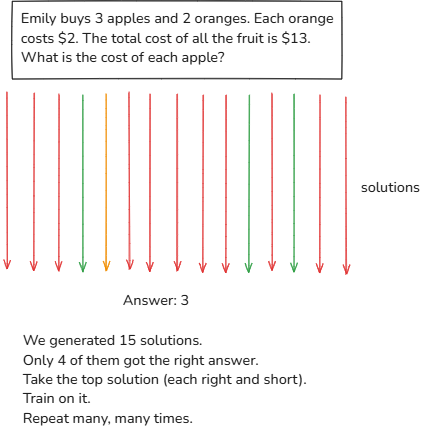

----------

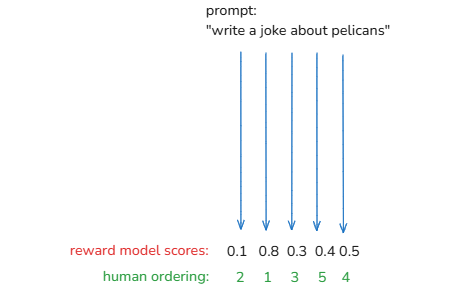

---

## 4. Key Operational Concepts and Limitations

*   **Hallucinations:** As probabilistic systems, LLMs can generate plausible-sounding but factually incorrect information. This is a primary risk that requires mitigation strategies.
*   **Tool Use:** To combat hallucinations and knowledge cutoffs, modern LLMs can be integrated with external tools, such as web search APIs or code interpreters, to ground their responses in real-time, factual data.
*   **Token-Based Processing:** LLMs operate on tokens, not characters. This can lead to weaknesses in character-level tasks like spelling, counting letters, or reversing strings.
*   **Chain of Thought Reasoning:** For complex tasks, LLMs perform best when allowed to generate intermediate reasoning steps. Forcing an immediate answer can degrade accuracy.

## 5. Conclusion

Every interaction with an LLM initiates a sophisticated pipeline: tokenization, embedding, contextual processing through Transformer layers, and probabilistic, token-by-token generation. The model's vast knowledge comes from pre-training, while its helpful, instruction-following behavior is meticulously shaped by post-training alignment with human feedback.

Understanding this architecture and process is essential for effectively developing applications with, and managing the risks of, this powerful technology. While not magic, the result is a testament to a powerful architecture trained at an unprecedented scale, capable of augmenting human creativity and productivity across industries.
